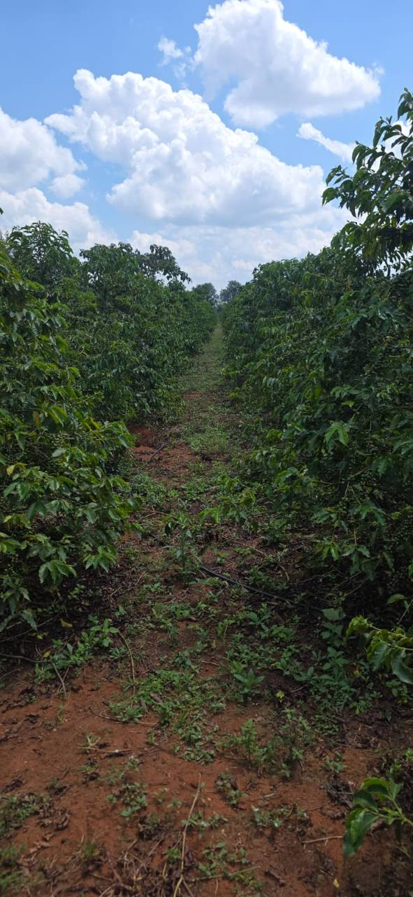

# SCOF — Kenyan Coffee Ecosystem

> From Kenyan coffee farms to a global digital ecosystem.

SCOF is a farm-first coffee initiative connecting real agricultural operations with traceability, software, artificial intelligence, responsible infrastructure, partnerships, and community development.

**Founded and owned by Engineer Saigut Julius Kipkorir, sole proprietor trading as ST-Firm.**

The central idea is straightforward:

> We are not building from nothing. We are digitizing and expanding an existing coffee ecosystem.

<p align="center">
  
</p>

## Table of contents

- [Overview](#overview)
- [Why SCOF](#why-scof)
- [Ownership and founder](#ownership-and-founder)
- [Project status](#project-status)
- [The ecosystem](#the-ecosystem)
- [Technology scope](#technology-scope)
- [ST-Firm's role](#st-firms-role)
- [Partnerships and linkages](#partnerships-and-linkages)
- [Repository structure](#repository-structure)
- [Run locally](#run-locally)
- [Deployment](#deployment)
- [GitHub setup](#github-setup)
- [Responsible development](#responsible-development)
- [Contributing](#contributing)
- [Contact](#contact)
- [License](#license)

## Overview

This repository contains the public-facing SCOF and ST-Firm website prototype. It presents:

- Existing coffee farms and field activity
- Coffee processing and drying infrastructure
- The SSOS farm-intelligence product vision
- Field-to-market traceability
- The wider SCOF partnership model
- ST-Firm as the engineering and systems-development layer
- Planned renewable-energy, partner-portal, and digital-infrastructure capabilities

The website is intentionally agriculture-first. Technology is positioned as a tool for strengthening farm operations, farmer knowledge, product quality, transparency, and access to markets.

## Why SCOF

SCOF begins with real-world foundations:

- Coffee farms and established trees
- Farmers and agricultural knowledge
- Processing and post-harvest facilities
- Field and product photography
- ST-Firm technology development
- A roadmap for responsible digital transformation

The long-term objective is to build a digitally connected coffee ecosystem where agriculture, AI, software, renewable energy, partnerships, and community work together to create traceable, sustainable, and globally competitive coffee.

## Ownership and founder

### Engineer Saigut Julius Kipkorir

Engineer Saigut Julius Kipkorir is the founder, proprietor, and systems engineer behind ST-Firm and the SCOF ecosystem.

His work connects Kenyan agricultural roots with engineering and technology development in Germany. SCOF is the first real-world proving ground for a wider systems vision: using software, AI, traceability, responsible infrastructure, and disciplined operational design to strengthen productive enterprises.

| Business detail | Information |
| --- | --- |
| Proprietor | Engineer Saigut Julius Kipkorir |
| Business name | ST-Firm |
| Legal form represented in this repository | Sole proprietorship |
| Flagship ecosystem | SCOF — coffee and agriculture |
| Technology system | SSOS — AI and operational software |
| Operating bridge | Kenya and Germany |
| Public contact channel | [WhatsApp: +49 1521 0207415](https://wa.me/4915210207415) |

In repository notices, **ST-Firm** is used as the proprietor's business or trading name. It should not be interpreted as a separate incorporated legal entity unless the business structure is formally changed and the documentation is updated.

Copyright ownership is stated as:

> Copyright © 2026 Engineer Saigut Julius Kipkorir, sole proprietor trading as ST-Firm. All rights reserved.

## Project status

This repository is currently a **static website and product-vision prototype**. It is not the production SSOS application.

| Area | Current status |
| --- | --- |
| SCOF public website | Implemented as a responsive static page |
| ST-Firm public website | Implemented as a responsive static page |
| Real farm and processing imagery | Included in the repository |
| SSOS command-centre interface | Illustrative product vision |
| Farm registry and field operations | Core platform scope |
| Batch traceability | Core platform scope |
| AI decision support | Planned capability |
| Buyer and partner portal | Planned capability |
| Connected energy and device data | Planned capability |
| Digital utility or treasury layer | Exploratory long-term vision |

Specific dashboard figures, field statuses, batch identifiers, and recommendations shown on the website are representative examples unless explicitly identified as verified operational data.

## The ecosystem

SCOF connects several physical and digital layers:

```text
Farms and farmers
        ↓
Processing and quality
        ↓
SSOS records and traceability
        ↓
Buyers, partners, and markets
        ↓
Feedback, insight, and value return to origin
```

The intended outcome is a system in which coffee and trusted information travel together—from an identified farm block through harvest, processing, drying, quality assessment, and market delivery.

## Technology scope

### Core platform scope

#### Farm registry and mapping

- Farm and block identification
- GPS and location records
- Coffee variety and plant age
- Field images and historical records

#### Field operations

- Field observations and inspection records
- Crop-health and disease monitoring
- Activity and work logs
- Yield and harvest history

#### Batch traceability

- Harvest lots and source blocks
- Processing methods and stages
- Drying records
- Quality and export batches
- Sustainability information

### Planned capabilities

#### AI-assisted decision support

- Field-image assistance
- Risk and anomaly signals
- Contextual recommendations
- Human-reviewed field priorities

AI is intended to support farmer and agronomist judgement—not replace it.

#### Buyer and partner portal

- Permission-based batch visibility
- Digital product passports
- Buyer feedback loops
- Partner and sustainability reporting

#### Connected infrastructure

- Sensor and device integrations
- Renewable-energy monitoring
- Payment and logistics connections
- Responsible digital infrastructure

## ST-Firm's role

[ST-Firm](st-firm.html) is the engineering backbone behind the SCOF digital ecosystem.

Its role includes:

- Product and system architecture
- Software and interface development
- Data and AI engineering
- Workflow automation
- Partner and device integrations
- Permission-aware access design
- Security-minded system development
- Continuous improvement based on real operations

SCOF provides a real agricultural proving ground. ST-Firm translates operational needs into systems that improve visibility, coordination, resilience, and decision-making.

The wider ST-Firm vision currently includes:

- **SCOF** — coffee, agriculture, processing, traceability, and commerce
- **SSOS** — AI and operational software
- **SAOS** — planned energy and digital infrastructure
- **Treasury systems** — a long-term resource and risk-intelligence vision

## Partnerships and linkages

SCOF is designed as a partnership ecosystem rather than a closed platform.

Priority relationships include:

- Farmers and cooperatives
- Coffee processors and millers
- Buyers, roasters, and hospitality businesses
- Logistics and export partners
- Agronomists and research institutions
- Technology, connectivity, and device providers
- Renewable-energy partners
- Impact and aligned capital partners

Partnerships should create measurable value for the physical coffee operation and its participants. Technology is introduced where it improves coordination, trust, quality, resilience, or market access.

## Repository structure

```text
SCOF/
├── index.html                 # Main SCOF ecosystem website
├── st-firm.html               # ST-Firm company and systems website
├── assets/                    # Images, brand assets, and shared footer system
│   ├── footer-system.css      # Shared premium footer design
│   └── footer-system.js       # Lightweight footer lighting and year handling
├── images coffe farm/         # Original farm-photo collection
├── README.md                  # Repository documentation
├── LICENSE                    # ST-Firm proprietary license
├── SCHOF index.html           # Earlier website prototype
├── hero-dark.jpg.png          # Legacy concept asset
├── hero-light.jpg.png         # Legacy concept asset
├── merch-scof.jpg.png         # Legacy merchandise concept
├── flyer-presale.jpg.jpeg     # Legacy presale concept
└── payments-ui.jpg.jpeg       # Legacy payment-interface concept
```

The legacy prototype and presale assets are not part of the current homepage experience. Review whether they should remain before making the repository public.

## Run locally

The project uses plain HTML, CSS, and JavaScript. It has no package manager, build step, or runtime dependency.

### Option 1: Open the file directly

Open `index.html` in a browser.

Some browser behavior is more reliable through a local HTTP server, so the server options below are recommended.

### Option 2: Python

From the project directory:

```bash
python -m http.server 8000
```

On Windows, if `python` is not available as a command:

```powershell
py -m http.server 8000
```

Then visit:

```text
http://localhost:8000/
```

### Option 3: Node.js (bundled dev server, recommended)

The repository ships a zero-dependency static server:

```bash
node scripts/dev-server.cjs
```

Then visit `http://localhost:8000/` (or `http://localhost:8000/st-firm.html`). Pass a port as the first argument (`node scripts/dev-server.cjs 5173`) if 8000 is busy.

Or use any static server, e.g.:

```bash
npx serve .
```

> **Do not open the `.html` files directly from disk (`file://`).** Browsers treat every `file://` document as a unique security origin, which blocks image/audio loads and makes the cinematic story's audio seeking unreliable. If you open a page as `file://`, an on-page banner will remind you to use the server above.

## Deployment

Because the site is static, it can be hosted on:

- GitHub Pages
- Cloudflare Pages
- Netlify
- Vercel
- Any standard web server or object-storage static host

All current page and asset links are relative, which makes the project suitable for repository-based static hosting.

### GitHub Pages

After pushing the repository to GitHub:

1. Open the repository on GitHub.
2. Go to **Settings → Pages**.
3. Under **Build and deployment**, select **Deploy from a branch**.
4. Select the `main` branch and `/ (root)` folder.
5. Save the configuration.

GitHub will provide the published URL after deployment finishes.

## GitHub setup

The current folder is **not yet a valid Git repository**. The `.git` directory exists but is empty, and no GitHub remote is configured.

Before publishing, decide whether the repository should be public or private and review the image and legacy-asset rights.

### Initialize the repository

Run these commands from the `SCOF` directory:

```bash
git init
git branch -M main
git add .
git commit -m "Initial SCOF website"
```

### Connect it to GitHub

Create an empty repository on GitHub, then replace the placeholder below with its actual URL:

```bash
git remote add origin https://github.com/<your-username>/<repository-name>.git
git push -u origin main
```

Do not initialize the remote repository with another README if this local README will be used for the first commit. That avoids an unnecessary first-commit conflict.

### Recommended checks before the first push

- Confirm the repository visibility: public or private
- Confirm permission to publish every included photograph
- Decide whether legacy presale and payment assets should remain
- Review the included ST-Firm proprietary license with a qualified legal professional
- Confirm public contact details
- Check the website on desktop and mobile
- Optimize large images for web delivery
- Remove any confidential data, credentials, or internal documents

## Responsible development

SCOF should maintain clear boundaries between current operations, product prototypes, planned capabilities, and long-term concepts.

- Illustrative interfaces must be identified as illustrative.
- Planned features must not be presented as deployed systems.
- AI output should remain reviewable by responsible people.
- Farm and partner data should use permission-aware access.
- Sustainability claims should be supported by evidence.
- Digital-asset concepts must not be presented as investment promises.
- No content in this repository constitutes an offer for sale, price announcement, or promise of financial return.

## Contributing

The project is proprietary and owner-led. Contributions are accepted only by prior arrangement with Engineer Saigut Julius Kipkorir.

Before contributing code, design, photography, documentation, or business material:

1. Obtain written approval for the proposed contribution.
2. Agree how ownership and permitted use of the contribution will be handled.
3. Create a focused branch from `main`.
4. Keep claims factual and distinguish implemented features from roadmap items.
5. Test both `index.html` and `st-firm.html` at desktop and mobile widths.
6. Verify that all local links and image paths resolve.
7. Open a pull request describing the purpose and visible impact of the change.

A pull request does not automatically transfer copyright or create an open-source license. Substantive contributions should be covered by a separate written contribution, assignment, employment, contractor, or partnership agreement as appropriate.

Suggested branch names:

```text
feature/traceability-section
fix/mobile-navigation
content/partner-profile
performance/image-optimization
```

## Contact

- Proprietor: **Engineer Saigut Julius Kipkorir**
- Business name: **ST-Firm**
- Role: Founder, sole proprietor, and systems engineer
- WhatsApp: [+49 1521 0207415](https://wa.me/4915210207415)

## Testing

Run the dependency-free website quality gate with:

```powershell
node tests\site-check.cjs
```

The suite validates both pages, local assets and links, WhatsApp routing, accessibility basics, script syntax, shared CSS, and local HTTP responses. See [TEST_REPORT.md](TEST_REPORT.md) for the latest recorded result.

## License

This repository is protected by the [ST-Firm Proprietary License](LICENSE).

Copyright © 2026 Engineer Saigut Julius Kipkorir, sole proprietor trading as ST-Firm. All rights reserved.

This is **not an open-source repository**. No permission is granted to copy, modify, redistribute, publish, commercialize, train AI systems with, or create derivative works from the code, written content, photography, product concepts, visual designs, documentation, or brand materials except under a separate written agreement.

Publishing a repository publicly on GitHub allows platform users to view and fork it under GitHub's platform terms; it does not make the project open source or grant broader reuse rights. For stronger access control before commercial launch, a private repository should be considered.

The proprietary license is a project document and should be reviewed by a qualified legal professional in the relevant jurisdiction before it is relied upon for commercial agreements, investment activity, employment, contracting, or enforcement.

---

**SCOF** · Rooted in Kenya · Engineered by ST-Firm · Founded by Engineer Saigut Julius Kipkorir
